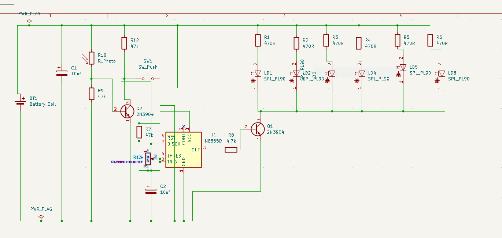
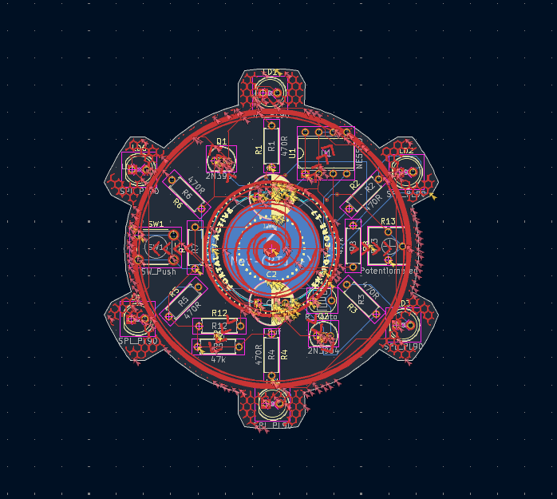
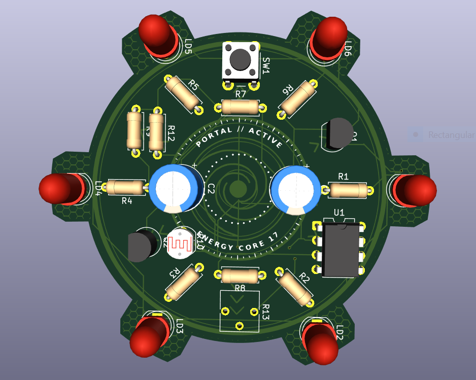

# Solder-PCB 
# Energyportel

The main function of the PCB is that there is a button which will control the functioning of all the LEDs present in the board. 

## Schematic

## PCB

## How to build
Order the PCB & components, Look at the KiCAD file and build it accordingly.

## BOM
Ref	Component	Value	Package	Qty
U1	555 timer	NE555P	DIP-8, through-hole	1
LD1–LD6	LED	Red, 5 mm	Through-hole	6
R1–R6	Resistor	470 Ω, ¼ W	Axial	6
R7, R9, R11, R12	Resistor	47 kΩ, ¼ W	Axial	4
R8	Resistor	4.7 kΩ, ¼ W	Axial	1
R10	Photoresistor (LDR)	5 mm, e.g. GL5528	Through-hole	1
R13	Potentiometer	1 kΩ (use your kit value)	Through-hole, 3-pin	1
Q1, Q2	NPN transistor	2N3904	TO-92	2
C1, C2	Electrolytic capacitor	10 µF, 16 V	Radial	2
SW1	Push button	6 × 6 mm tactile	4-pin, through-hole	1
BT1	CR2032 battery holder	3 V	Through-hole	1
Made by Evan!!

Made as a part of http://solder.hackclub.com/!
